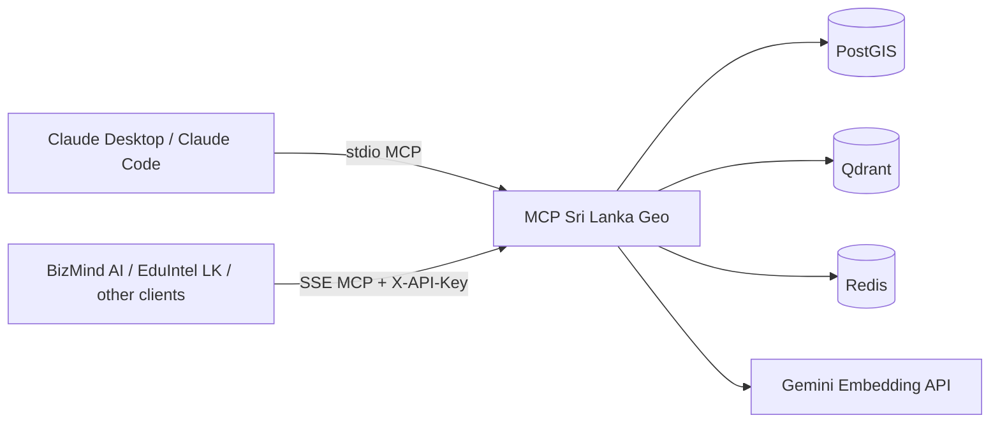
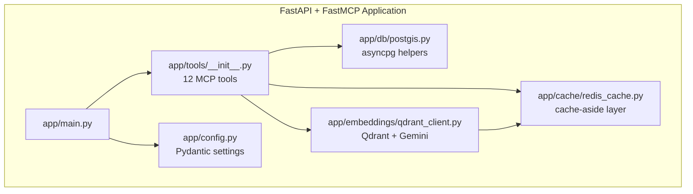
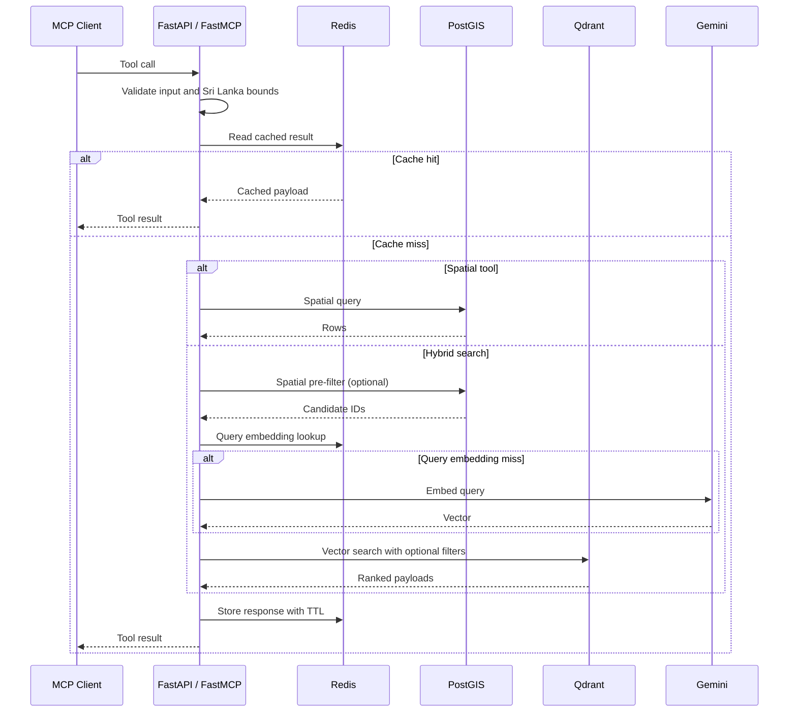
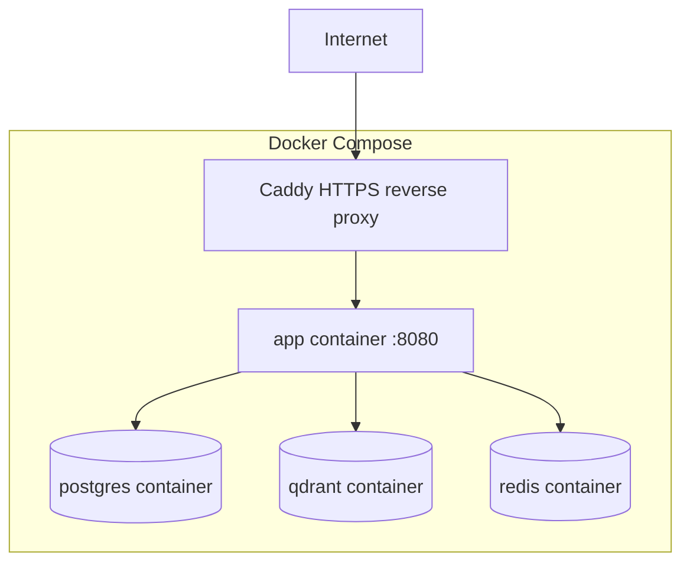
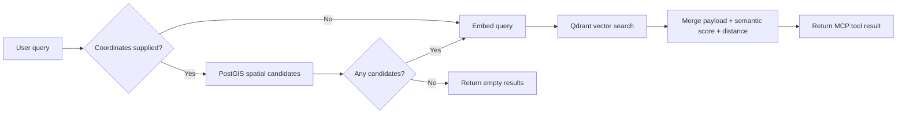
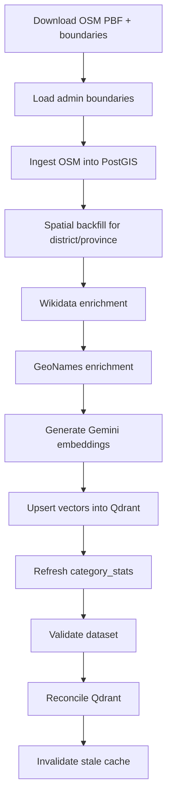

# MCP Sri Lanka Geo

Production-grade Model Context Protocol (MCP) server for Sri Lanka geospatial search. It exposes Sri Lanka Points of Interest (POIs) as structured MCP tools backed by PostGIS, Qdrant, Redis, and Gemini embeddings.

The repository is designed for LLM clients that need location-aware retrieval over Sri Lankan administrative areas, nearby POIs, commercial entities, universities, agricultural zones, and hybrid semantic search.

## Overview

- Runtime: FastAPI + FastMCP
- Primary store: PostgreSQL 16 + PostGIS 3.4
- Vector search: Qdrant
- Cache: Redis 7
- Embeddings: Gemini, 768 dimensions
- Transports: `stdio` for local clients, SSE for network clients
- Auth: API key on SSE only, local stdio intentionally unauthenticated



## What The Server Does

The app registers 12 MCP tools in [app/tools/__init__.py](/g:/MCP-Sri-Lanka-Geo/app/tools/__init__.py). Those tools validate Sri Lanka coordinates, execute spatial lookups through PostGIS, perform semantic ranking through Qdrant, and cache hot responses in Redis using a cache-aside pattern.

The HTTP server lives in [app/main.py](/g:/MCP-Sri-Lanka-Geo/app/main.py). Startup initializes the async PostGIS pool, Redis client, and Qdrant client in that order. The app then exposes:

- `GET /health` for dependency health
- `GET /sse` for authenticated SSE MCP sessions
- `POST /messages/` as the mounted SSE message endpoint

## Architecture

### Runtime Components



### Request Flow



### Production Topology



In development, [docker-compose.yml](/g:/MCP-Sri-Lanka-Geo/docker-compose.yml) exposes `8080`, `5433`, `6333`, `6334`, and `6379`. In production, [docker-compose.prod.yml](/g:/MCP-Sri-Lanka-Geo/docker-compose.prod.yml) removes direct exposure for Postgres, Qdrant, and Redis, binds the app to `127.0.0.1:8080`, and adds Caddy for TLS termination.

## Repository Structure

```text
mcp-srilanka-geo/
├── app/
│   ├── main.py
│   ├── config.py
│   ├── auth/
│   ├── cache/redis_cache.py
│   ├── db/postgis.py
│   ├── db/migrations/
│   ├── embeddings/qdrant_client.py
│   └── tools/__init__.py
├── scripts/
├── tests/
├── data/
├── docker-compose.yml
├── docker-compose.prod.yml
├── Dockerfile
├── Caddyfile
└── requirements*.txt
```

## MCP Tools

The tool surface is registered from [app/tools/__init__.py](/g:/MCP-Sri-Lanka-Geo/app/tools/__init__.py).

| Tool | Purpose |
|---|---|
| `find_nearby` | Radius-based nearby POI search with optional category filter |
| `get_poi_details` | Retrieve a single POI by OSM-prefixed ID |
| `get_administrative_area` | Reverse-geocode a point to district, province, and optional DS division |
| `validate_coordinates` | Check if coordinates fall inside Sri Lanka bounds |
| `get_coverage_stats` | Read precomputed POI counts from `category_stats` |
| `search_pois` | Hybrid semantic + spatial search using PostGIS + Gemini + Qdrant |
| `list_categories` | Category and subcategory inventory with counts |
| `get_business_density` | Category distribution within a radius |
| `route_between` | Straight-line distance and bearing between POIs |
| `find_universities` | Nearby higher education entities |
| `find_agricultural_zones` | Nearby agricultural land-use entities |
| `find_businesses_near` | Nearby businesses and commercial amenities |

## Core Design Rules Reflected In Code

- Every `pois` query is expected to exclude soft-deleted records.
- Spatial search validates coordinates before any DB call.
- Redis failures degrade gracefully and must not prevent tool responses.
- SSE requires `X-API-Key`; stdio does not.
- `search_pois` uses spatial pre-filtering first when coordinates are supplied.
- If the spatial radius returns zero candidates, semantic search does not fall through to global Qdrant search.

These behaviors are implemented in [app/main.py](/g:/MCP-Sri-Lanka-Geo/app/main.py), [app/db/postgis.py](/g:/MCP-Sri-Lanka-Geo/app/db/postgis.py), [app/cache/redis_cache.py](/g:/MCP-Sri-Lanka-Geo/app/cache/redis_cache.py), and [app/tools/__init__.py](/g:/MCP-Sri-Lanka-Geo/app/tools/__init__.py).

## Data Model And Search Strategy

### Data Stores

- PostGIS stores canonical POIs and admin boundaries.
- Qdrant stores semantic vectors and indexed payload fields.
- Redis stores cached tool responses and cached query embeddings.

### Hybrid Search

`search_pois` is the main multi-stage retrieval path:

1. Validate the request and normalize limit and radius.
2. If coordinates are present, run a PostGIS spatial candidate query.
3. If spatial candidates are empty, return an empty result immediately.
4. Embed the natural-language query, using Redis caching for the query vector.
5. Search Qdrant with optional candidate ID filtering and optional category filtering.
6. Merge semantic scores with spatial distances before returning the result.



## Cache Design

The cache layer is implemented in [app/cache/redis_cache.py](/g:/MCP-Sri-Lanka-Geo/app/cache/redis_cache.py). Floats are rounded to 4 decimal places for key stability.

| Cache key family | TTL |
|---|---|
| `poi_detail:{poi_id}` | 24h |
| `spatial:{lat}:{lng}:{r}:{cat}` | 30m |
| `semantic:{sha256[:16]}` | 30m |
| `admin:{lat}:{lng}` | 7d |
| `density:{lat}:{lng}:{r}` | 1h |
| `categories:{district or all}` | 6h |

Redis is intentionally optional at runtime. The app treats Redis outages as degraded performance, not total failure. That behavior is verified in [tests/test_health.py](/g:/MCP-Sri-Lanka-Geo/tests/test_health.py) and [tests/test_resilience.py](/g:/MCP-Sri-Lanka-Geo/tests/test_resilience.py).

## Ingestion And Enrichment Pipeline

The repository includes an offline pipeline for loading and maintaining the dataset.

### Pipeline Stages



### Script Inventory

| Script | Role |
|---|---|
| `scripts/load_admin_boundaries.py` | Load GADM GeoJSON into `admin_boundaries` |
| `scripts/ingest_osm.py` | Parse OSM PBF and upsert POIs into PostGIS |
| `scripts/spatial_backfill.py` | Backfill district and province assignments |
| `scripts/enrich_wikidata.py` | Add Wikidata metadata |
| `scripts/enrich_geonames.py` | Match POIs with GeoNames records |
| `scripts/generate_embeddings.py` | Generate embeddings and populate Qdrant |
| `scripts/refresh_category_stats.py` | Refresh precomputed category totals |
| `scripts/validate_dataset.py` | Run post-ingest integrity checks |
| `scripts/reconcile_qdrant.py` | Detect PostGIS and Qdrant sync drift |
| `scripts/invalidate_cache.py` | Remove stale detail cache after updates |
| `scripts/load_test.py` | Exercise runtime under concurrent request load |
| `scripts/backup.sh` | Back up state before destructive refreshes |

### Embedding Pipeline

The embedding workflow in [scripts/generate_embeddings.py](/g:/MCP-Sri-Lanka-Geo/scripts/generate_embeddings.py) is resumable and crash-safe:

- It selects only POIs whose embeddings are missing or stale.
- It builds null-safe embedding text from POI name, category, district, province, and enrichment fields.
- It batches Gemini requests and retries with exponential backoff.
- It writes `qdrant_id` and `last_embed_sync` back to PostGIS only after successful Qdrant upsert.

## Quick Start

### Prerequisites

- Docker Desktop
- A populated `.env` file based on `.env.example`
- Optional: Gemini API key if you plan to run semantic embedding or `search_pois`

### 1. Configure Environment

```bash
cp .env.example .env
```

Set at least:

- `DATABASE_URL`
- `DB_PASSWORD`
- `REDIS_PASSWORD`
- `REDIS_URL`
- `QDRANT_URL`
- `GEMINI_API_KEY`
- `API_KEYS`

Generate strong keys with:

```bash
python -c "import secrets; print(secrets.token_hex(32))"
```

### 2. Start Infrastructure

```bash
docker compose up -d
docker compose ps
```

### 3. Verify Runtime Health

```bash
curl http://localhost:8080/health
```

Expected shape:

```json
{"version":"1.0.0","dependencies":{"postgis":"ok","qdrant":"ok","redis":"ok"}}
```

### 4. Load Data

Download the Sri Lanka PBF and boundary files into `data/`, then run the ingestion scripts in order.

```bash
docker exec --user root mcp-srilanka-geo bash -c "apt-get update && apt-get install -y libexpat1 && pip install osmium rapidfuzz"

docker exec mcp-srilanka-geo bash -c "cd /app && python scripts/load_admin_boundaries.py --level1 data/gadm41_LKA_1.json --level2 data/gadm41_LKA_2.json"
docker exec mcp-srilanka-geo bash -c "cd /app && python scripts/ingest_osm.py --pbf data/sri-lanka-latest.osm.pbf"
docker exec mcp-srilanka-geo bash -c "cd /app && python scripts/spatial_backfill.py"
docker exec mcp-srilanka-geo bash -c "cd /app && python scripts/enrich_wikidata.py"
docker exec mcp-srilanka-geo bash -c "cd /app && python scripts/enrich_geonames.py --geonames /tmp/LK.txt"
docker exec mcp-srilanka-geo bash -c "cd /app && python scripts/generate_embeddings.py"
docker exec mcp-srilanka-geo bash -c "cd /app && python scripts/refresh_category_stats.py"
docker exec mcp-srilanka-geo bash -c "cd /app && python scripts/validate_dataset.py"
docker exec mcp-srilanka-geo bash -c "cd /app && python scripts/reconcile_qdrant.py"
```

## How to Connect

This server speaks the **Model Context Protocol (MCP)**. Any AI agent or tool that supports MCP can connect to it and use all 12 tools automatically — no custom integration code needed.

There are two ways to connect depending on where your agent runs.

---

### Option A — Claude Desktop (local, no API key needed)

Claude Desktop connects over **stdio** — it just launches the server as a local process. No network, no API key.

**Step 1.** Open your Claude Desktop config file:

- macOS: `~/Library/Application Support/Claude/claude_desktop_config.json`
- Windows: `%APPDATA%\Claude\claude_desktop_config.json`

**Step 2.** Add this block:

```json
{
  "mcpServers": {
    "srilanka-geo": {
      "command": "docker",
      "args": ["exec", "-i", "mcp-srilanka-geo", "python", "-m", "app.main", "stdio"]
    }
  }
}
```

**Step 3.** Restart Claude Desktop.

You will now see **srilanka-geo** listed as a connected tool. Start asking questions in plain English — Claude will call the right tool automatically.

> Example: *"Find hospitals within 5km of Colombo Fort"*

---

### Option B — Any MCP-compatible agent or platform (SSE, needs API key)

Antigravity, custom AI agents, or any platform that supports MCP over SSE connects to the HTTP endpoint.

**What you need:**
- The server URL: `https://your-domain.com/sse`
- An API key (contact the server operator to get one)

**Step 1.** In your agent platform, find the option to add an MCP server. It may be called "Add Tool", "Connect MCP", or "Add Integration".

**Step 2.** Enter:

```
Transport:  SSE
URL:        https://your-domain.com/sse
Header:     X-API-Key: <your-api-key>
```

**Step 3.** Save. The platform will connect and automatically discover all 12 tools.

That's it. Your agent can now answer location-aware questions about Sri Lanka.

> Example: *"What universities are within 20km of Kandy?"*

---

### Option C — Custom AI agent (developer)

If you are building your own agent using the Anthropic SDK or any MCP client library, connect like this:

```python
from mcp import ClientSession
from mcp.client.sse import sse_client

async with sse_client(
    "https://your-domain.com/sse",
    headers={"X-API-Key": "your-api-key"}
) as (read, write):
    async with ClientSession(read, write) as session:
        await session.initialize()
        tools = await session.list_tools()  # all 12 tools ready to use
```

Pass the tools to `claude-opus-4-6` or any Claude model and the agent will call them as needed.

---

### What the user sees vs what happens behind the scenes

The end user never interacts with MCP directly. They just type a question:

```
User:  "Are there any banks near our new office in Kandy?"

Agent: calls find_nearby(lat=7.2906, lng=80.6337, subcategory="bank", radius_km=2)

User:  "Yes — there are 6 banks within 2km:
        - Bank of Ceylon (340m)
        - People's Bank (520m)
        - HNB (780m) ..."
```

---

### Getting an API key

SSE connections require an API key. Register instantly — no approval, no waiting:

```bash
curl -X POST https://your-domain.com/keys/register \
  -H "Content-Type: application/json" \
  -d '{
    "app_name": "MyApp",
    "contact":  "you@example.com",
    "use_case": "Building a location-aware chatbot"
  }'
```

```json
{
  "api_key":  "51946848e97a9fe5aab70e6cfbe8269f842594b4f81a92e0043d8097c839a82d",
  "prefix":   "51946848e97a9fe5",
  "warning":  "Save this key now — it will never be shown again.",
  "usage":    "Add header  X-API-Key: <your-key>  to every request."
}
```

Save the `api_key` immediately — it is shown once and never stored in plaintext.

### Revoking a key (admin only)

```bash
# List all keys and their IDs
curl https://your-domain.com/admin/keys \
  -H "X-Admin-Key: <admin-key>"

# Revoke by ID — takes effect immediately
curl -X DELETE https://your-domain.com/admin/keys/3 \
  -H "X-Admin-Key: <admin-key>"
```

The admin key is set via `ADMIN_KEY` in `.env` and is separate from regular API keys.

---

## Transport Modes

| Mode | How it is used | Auth behavior |
|---|---|---|
| `stdio` | Claude Desktop, Claude Code, local tooling | No auth, local process only |
| `SSE` | Remote network clients | `X-API-Key` required on `/sse` |

The transport and auth behavior is implemented in [app/main.py](/g:/MCP-Sri-Lanka-Geo/app/main.py).

## Claude Desktop Integration

```json
{
  "mcpServers": {
    "srilanka-geo": {
      "command": "docker",
      "args": ["exec", "-i", "mcp-srilanka-geo", "python", "-m", "app.main", "stdio"]
    }
  }
}
```

## Configuration Reference

Settings are loaded through [app/config.py](/g:/MCP-Sri-Lanka-Geo/app/config.py) using Pydantic Settings.

| Variable | Meaning |
|---|---|
| `DATABASE_URL` | Async Postgres connection string |
| `QDRANT_URL` | Qdrant HTTP endpoint |
| `QDRANT_API_KEY` | Optional Qdrant API key |
| `QDRANT_COLLECTION` | Collection name, defaults to `srilanka_pois` |
| `REDIS_URL` | Redis connection string |
| `GEMINI_API_KEY` | Gemini embedding key |
| `API_KEYS` | Comma-separated SSE API keys for existing consumers (.env-managed) |
| `REQUIRE_AUTH` | Validation flag for configured auth expectations |
| `ADMIN_KEY` | Key for `/admin/keys` endpoints (list, revoke) — min 32 chars |
| `APP_VERSION` | Runtime version string |

## Testing

The repo includes focused pytest coverage around core runtime behavior:

- [tests/test_tools.py](/g:/MCP-Sri-Lanka-Geo/tests/test_tools.py) covers the MCP tool surface.
- [tests/test_search.py](/g:/MCP-Sri-Lanka-Geo/tests/test_search.py) covers hybrid semantic search and embedding text construction.
- [tests/test_health.py](/g:/MCP-Sri-Lanka-Geo/tests/test_health.py) covers dependency health semantics.
- [tests/test_cache.py](/g:/MCP-Sri-Lanka-Geo/tests/test_cache.py) covers Redis cache behavior.
- [tests/test_spatial.py](/g:/MCP-Sri-Lanka-Geo/tests/test_spatial.py) covers spatial correctness.
- [tests/test_resilience.py](/g:/MCP-Sri-Lanka-Geo/tests/test_resilience.py) covers degraded dependency modes.

Run tests inside the container:

```bash
docker exec --user root mcp-srilanka-geo pip install -r requirements-dev.txt
docker exec mcp-srilanka-geo bash -c "cd /app && pytest tests/ -v"
```

## Deployment

### Development

Use [docker-compose.yml](/g:/MCP-Sri-Lanka-Geo/docker-compose.yml) directly.

```bash
docker compose up -d
```

### Production

Use the production overlay and Caddy reverse proxy:

```bash
docker compose -f docker-compose.yml -f docker-compose.prod.yml up -d
```

Set `DOMAIN` before starting production. [Caddyfile](/g:/MCP-Sri-Lanka-Geo/Caddyfile) configures HTTPS, upstream health checks, SSE-friendly proxy behavior, and security headers.

## Health Model

The `/health` endpoint returns:

- `200` when PostGIS and Qdrant are healthy and Redis is either healthy or degraded
- `503` when PostGIS or Qdrant are unavailable

That distinction matters because Redis is a performance dependency, while PostGIS and Qdrant are functional dependencies.

## Operational Notes

- Keep `data/`, backups, `.env`, and local Claude files out of git.
- Use backups before large reingestion runs.
- Refresh `category_stats` after ingest so coverage tools stay cheap.
- Re-run `generate_embeddings.py` and `reconcile_qdrant.py` after large content changes.
- Prefer the production compose overlay for any public deployment.

## License

Private repository. All rights reserved.